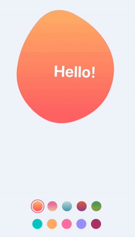

## Other React Native Toys
https://react-native.toys

## Animated Blob
### Preview


### Features
1. High Performance : No problem in low-end devices
2. Low Dependency : Uses only ART
3. All Platforms : Works on iOS/Android
4. Hooks : All function components with hooks
5. No errors : Flow & eslint all passed

### Reason for using ART instead of react-native-svg
`ART` is a built-in library included in the core up to RN 0.61. I know `react-native-svg` provides more functionality, but I wanted to show you how to implement it with low dependency. :)

### How to build and run
```shell
$ git clone https://github.com/ifsnow/AnimatedBlob.git
$ cd AnimatedBlob
$ yarn install
$ cd ios
$ pod install
$ cd ..
$ react-native run-ios
```

## Reasons to continue this toy project
I hope this helps someone. If so, I would be happy to prepare these.

## Thanks
- Inspired by : [Blob generator](https://blobs.app)
